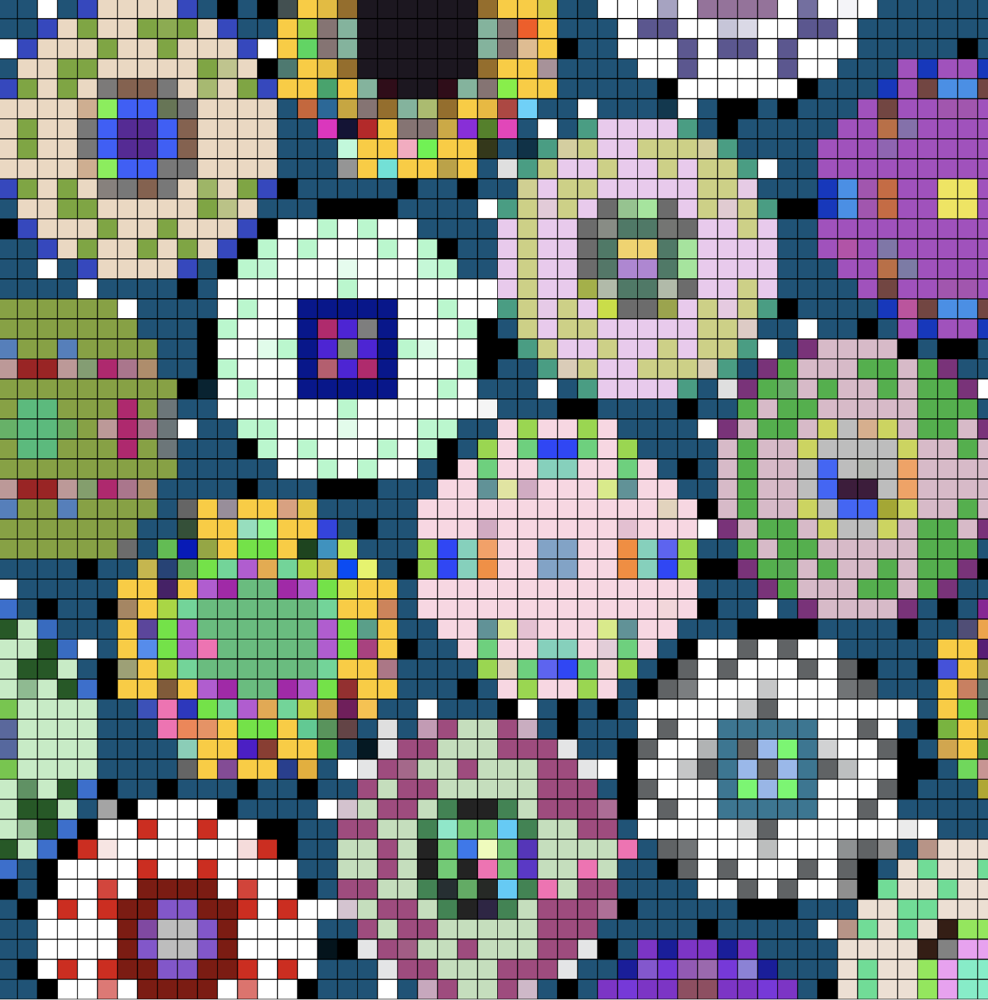
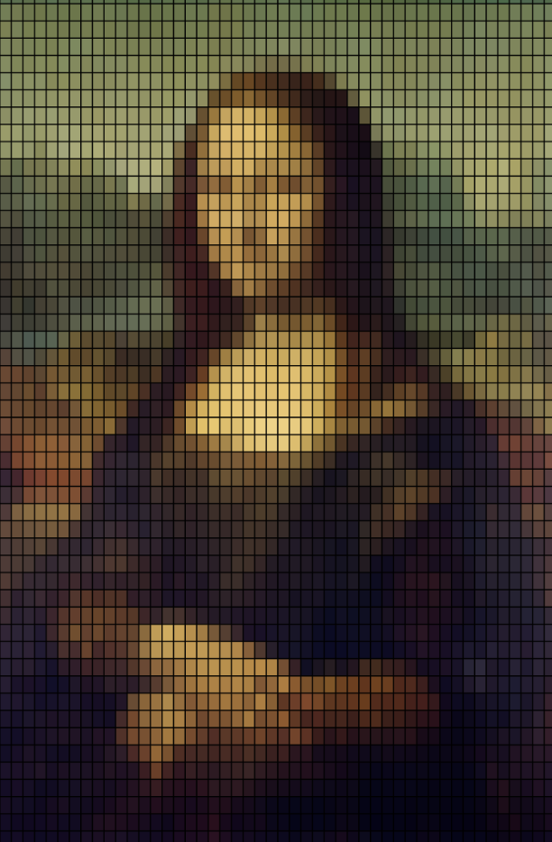

# ygon0450_Individual-Task

## Interactive explanation
I have created a total of 3 effects, effect 1 is that when the mouse is moved from left to right, the page refresh speed changes from fast to slow. Effect 2 is that when the spacebar is pressed, the page will change its style and transform into a pixel like effect. Effect 3 is to scale the distance with the mouse cursor, and the farther the distance, the larger they will be.

## Individual Approach
I choose "User Input: Incorporate mouse or keyboard inputs for animation" to drive my individual code.

My idea is to extend our group's initial ideas through the "User Input" method I have chosen. So I created a way to speed up or slow down page refresh by moving the mouse from left to right. I make the page automatically refresh and change the speed by adding mouse control. But after the group discussion, I found that the principle of my creation was somewhat similar to that of a member, so I added keyboard control. Using the spacebar to transform the original work into a rectangular split like pixel effect is my favorite effect I learned in this course, so I added it to my work. I also added the interactive effects extended from week 7.

My idea is to extend our group's initial ideas through the "User Input" method I have chosen. So I created a way to speed up or slow down page refresh by moving the mouse from left to right. I make the page automatically refresh and change the speed by adding mouse control. But after the group discussion, I found that the principle of my creation was somewhat similar to that of a member, so I added keyboard control. Using the spacebar to transform the original work into a rectangular split like pixel effect is my favorite effect I learned in this course, so I added it to my work. I also added interactive effects extended from Week 7, where the farther the mouse moves, the larger they become.

 
  

## Technical Explanation
**1. Regenerating dynamic backgrounds and segmented images**
Use frameCount and mouseX to dynamically adjust the frequency of regenerating background images. This is achieved by mapping mouseX to a time value and then calling generateGraphicsAndSegments() when the frame at that time interval is reached. This method correlates the changes in the background image with the mouse movement speed.

**2. Explanation of Image Segmentation Technology**
In this code, the image is divided into multiple small segments, which is achieved by creating an ImageSegment class to manage the properties of each image segment. The segmentation process occurs in the generateGraphicsAndSegments() function. Firstly, determine the width and height of the segmentation, and then create an ImageSegment instance for each image segment by iterating through the entire image through a nested loop.

**3. Dynamic Display Technology Description**
Calculate the distance between each image segment and the mouse pointer in the draw() function, and adjust the scaling ratio of the segment based on this distance. This scaling ratio directly affects the drawing size of the clip, so when moving the mouse, the image clip closer to the mouse will be enlarged and displayed.

**4. Space bar to switch display mode**
Switch the display mode of the image by using the spacebar on the keyboard. When the spacebar is pressed, the drawSegments variable switches. This variable controls whether the image is drawn in segmentation mode, allowing users to change the display of the image through simple button operations.